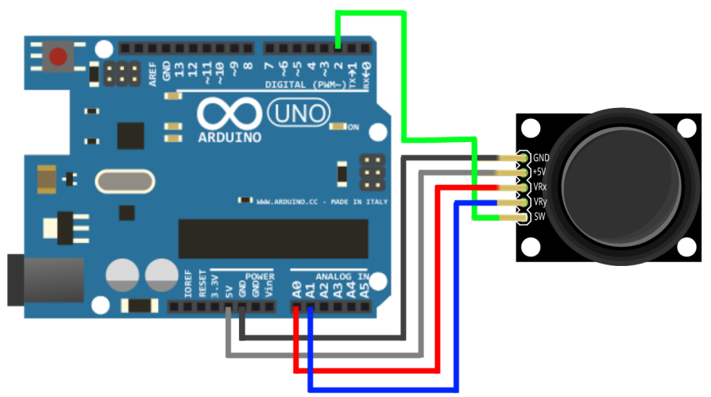

# Axis Joystick Library

For Arduino ant STM32 boards.

The Library implements a set of methods for working with an axis
joystick controller.
Dual axis XY joystick module reading.

The Analog Joystick is similar to two potentiometers connected together,
one for the vertical movement (Y-axis) and other for the horizontal
movement (X-axis). The joystick also comes with a button.

The Arduino Uno or any other Arduino board that uses Atmega328 as
the Microcontroller has ADC resolution of 10 bits. Hence the values on each
analog channel can vary from 0 to 1023.
The STM32 board has ADC resolution of 12 bits. Hence the values on each analog
channel can vary from 0 to 4095.

The home position for the stick is at (x,y:511,511, for Arduino).
If the stick is moved on X axis from one end to the other, the X values will
change from 0 to 1023 and similar thing happens when moved along the Y axis.
On the same lines you can read position of the
stick anywhere in upper half hemisphere from combination of these values.

## Installation

1. [Download](https://github.com/YuriiSalimov/AxisJoystick/releases) the Latest release from gitHub.
2. Unzip and modify the Folder name to "AxisJoystick" (Remove the '-version')
3. Paste the modified folder on your Library folder
(On your `libraries` folder inside Sketchbooks or Arduino software).
4. Restart the Arduino IDE.

## Circuit Diagram



## Methods

```cpp
/**
    SW - a digital port number of a button.
    VRx - a analog port number of X-axis.
    VRy - a analog port number of Y-axis.
*/
AxisJoystick joystick(SW, VRx, VRy);

/**
    Enums of a possible pressings
    of the joystick controller:
        PRESS - button is pressed;
        UP - Y-axis is pressed up;
        DOWN - Y-axis is pressed down;
        RIGTH - X-axis is pressed right;
        LEFT - X-axis is pressed left;
        NOT - otherwise.
*/
enum Move {
    PRESS, UP, DOWN, RIGHT, LEFT, NOT
};

/**
    Single reading of the joystick controller.
    If the joystick is clamped, the next
    value of pressing - NOT.
    Return value of pressing the joystick:
        Move::PRESS - button is pressed;
        Move::UP - Y-axis is pressed up;
        Move::DOWN - Y-axis is pressed down;
        Move::RIGTH - X-axis is pressed right;
        Move::LEFT - X-axis is pressed left;
        Move::NOT - otherwise.
*/
joystick.singleRead();

/**
    Multiple reading of the joystick controller.
    If the joystick is clamped,
    returns a pressed button value.
    Return value of pressing the joystick:
        Move::PRESS - button is pressed;
        Move::UP - Y-axis is pressed up;
        Move::DOWN - Y-axis is pressed down;
        Move::RIGTH - X-axis is pressed right;
        Move::LEFT - X-axis is pressed left;
        Move::NOT - otherwise.
*/
joystick.multipleRead();

/**
    Checks if the joystick button is pressed.
    Return true - button is pressed,
    false - button is not pressed.
*/
joystick.isPress();

/**
    Checks if the joystick is pressed up (Y-axis).
    Return true - joystick is pressed up,
    false - joystick is not pressed.
*/
joystick.isUp();

/**
    Checks if the joystick is pressed down (Y-axis).
    Return true - joystick is pressed down,
    false - joystick is not pressed.
*/
joystick.isDown();

/**
    Checks if the joystick is pressed right (X-axis).
    Return true - joystick is pressed right,
    false - joystick is not pressed.
*/
joystick.isRight();

/**
    Checks if the joystick is pressed left (X-axis).
    Return true - joystick is pressed left,
    false - joystick is not pressed.
*/
joystick.isLeft();

// Returns the joystick X axis coordinate (VRx).
joystick.xAxis();

// Returns the joystick Y axis coordinate (VRy).
joystick.yAxis();

/**
    Joystick axes calibration.
    LOW - the lower bound of the values range (default, 0);
    HIGH - the upper bound of the values range (default, 1023);
*/
joystick.calibrate(LOW, HIGH);

/**
    Joystick axes calibration.
    LOW - the lower bound of the values range (default, 0);
    HIGH - the upper bound of the values range (default, 1023);
    DEVIATION - deviation from the value’s axis range (default, 100),
        when the axis is considered activated:
        axis value <= (LOW + DEVIATION)
        or
        axis value >= (HIGH - DEVIATION).
*/
joystick.calibrate(LOW, HIGH, DEVIATION);
```

### Examples

[Single reading...](/examples/SingleReading/SingleReading.ino)

[Multiple reading...](/examples/MultipleReading/MultipleReading.ino)

[How to calibrate axes...](/examples/CalibrateJoystick/CalibrateJoystick.ino)

[How to invert axis...](/examples/InvertAxis/InvertAxis.ino)

[How to replace axes...](/examples/ReplaceXY/ReplaceXY.ino)

[STM32...](/examples/STM32/STM32.ino)

[All examples](/examples)...

Created by Yurii Salimov.
